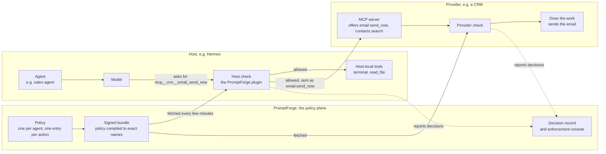

# Implementer's Guide — Governing One Agent

**Audience:** someone putting PromptForge Act enforcement on a host, or
writing a Policy Enforcement Point of their own.

**This is not the install walkthrough.** Place the plugin, set env, and
deny-proof in the
[Hermes Plugin Implementation & Install Guide](./hermes-plugin-implementation-guide.md).
This document is the best-practice layer: what has to be true for
enforcement to be real, and what the console will show when it is.

`<agent_key>` must match the Hermes profile name and the PromptForge
profile, character for character.

---

## 1. What you are putting in place

Three things, in this order.

1. **A PEP on the tool path.** `pre_tool_call` → local PDP `evaluate` →
   block when denied. Not a SOUL line. The model cannot talk past a
   blocked tool.
2. **One gateway process per agent.** That process owns one
   `PF_AGENT_KEY`. Do not share env or a plugin directory across
   profiles.
3. **A declaration** that this agent *should* be enforced
   (`enforcement_expected` on the PromptForge profile). Without that
   flag, a missing PEP and a dormant agent look the same.

Talk (content pack) is soft. Act (signed bundle) is hard: cache →
grace → **fail-closed deny**. If you only inject pack text, you have
not enforced anything.

### 1.1 The pieces and their names

A tool call can be checked twice: once by the host before the call
leaves it, and once by the provider before it does the work. Both
checks read the same signed policy, and both can report what they
decided.



| Term | Meaning | Example |
|---|---|---|
| Agent | An AI worker with its own identity and policy | `sales-agent` |
| Model | The language model that decides which tool to call | any LLM |
| Host | The program that runs agents: holds the conversation, offers tools to the model, runs the calls | Hermes |
| Tool | One action a model can ask for | send an email, run a terminal command |
| Host-local tool | A tool the host implements itself. Its provider is `host` | `terminal`, `read_file` |
| Provider | The system that owns a tool and does the actual work | a CRM; PromptForge itself (`get_context`) |
| MCP server | How a provider offers its tools to hosts. The host connects to it as an MCP client, under a server name the host chooses | the CRM's MCP endpoint, connected as `crm` |
| Naming convention | How a host spells a provider's tool when it offers it to the model | `email.send_now` offered as `mcp__crm__email_send_now` |
| Enforcement point | A check that looks policy up: the host's, or a provider's own | the host plugin; the CRM's MCP-boundary check |
| Policy | What an agent may do, per action, authored in PromptForge | `sales-agent` may call `email.send_now`, with approval |
| Bundle | The signed copy of a policy that each check downloads, with every name spelled exactly as that check will look it up | `sales-agent`'s bundle, version 13 |
| Decision | One check's answer to one tool call, reported to PromptForge | `deny`, reason `unknown_tool` |

§5.5 explains how one policy entry becomes the exact name each check
sees.

---

## 2. The enforcement-point contract

PromptForge cannot see your process. It can only see the HTTP you send
when you fetch a pack or a bundle.

### 2.1 Headers — on the **fetch**, not the decision

| Header | What to put | Why |
|---|---|---|
| `X-PromptForge-Pep-Build` | Content hash of *this PEP's* runtime sources (12 hex is enough) | The pack is versioned. The enforcing *code* is not, unless you send this. |
| `X-PromptForge-Pep-Version` | Human label (`1.5.0`) | Logs. The standing check compares **build**, not this. |
| `X-PromptForge-Pep-Instance` | Per-process id, new on every start | Two copies of the same build are otherwise one row. |
| `X-PromptForge-Pep-Role` | `gateway` \| `interactive` \| `dashboard` \| `command` \| `service` | Residency is judged by **role and span**, not by how many times something fetched. A human CLI session beside a gateway is a legitimate second PEP. |

Send them on **every** `GET /api/governance/packs/…` and
`GET /api/governance/bundles/…`.

Do **not** send them only when you POST a decision.
`report_decisions` is per-agent opt-in. Plain allows are sampled. The
signal that the agent is *present* has to live on a channel nobody
can switch off.

This kit's Python plugin does this in `hermes-plugin/build.py` →
`build_headers()`, attached in `pdp.py` on each fetch.

### 2.2 Absent means absent

A missing header is stored as missing. Do not invent a default build,
instance, or role "so the row looks complete". A request with no
build is either an old PEP or something that is not a PEP.

### 2.3 One hash map per artifact class

If a second service also evaluates this agent's bundle (a relying
party), it runs **different software**. Compare builds only within a
class (gateway plugin vs service PDP). Mixing them reports drift
between two current, unrelated programs.

### 2.4 `service` is a claim, not a proof

A relying party that sends `X-PromptForge-Pep-Role: service` is exempt
from the one-gateway-per-agent rule. That exemption rests on the
process's own word. Treat an undeclared service enforcer as a warning,
not a pass.

---

## 3. What "done" looks like in the console

The enforcement console enumerates states. It does not treat the
fleet as a boolean.

| Policy published | PEP reporting | Declared (`enforcement_expected`) | State | What to do |
|---|---|---|---|---|
| yes | yes | yes | **governed** | This is the point. |
| yes | no | **yes** | **promise broken** | You said it would be enforced. Find the PEP. |
| yes | yes | no | **off the record** | Something is governing an agent nobody declared. |
| yes | no | no | **awaiting enforcement** | Normal while you install. Investigate if it is still true weeks later. |
| no | no | no | **unauthored** | Write the policy first. |
| no | no | no, no fetches | dormant | Out of the headline. |

Two more situations to recognize:

- A PEP is fetching **and** there is no published policy. That is not
  governed. Something checked in; a policy does not exist yet.
- History unreadable (events exist but cannot be attributed) is not
  an empty org and is not a quiet afternoon.

**Declaration is what makes an absence a fault.** A published policy
with no plugin is *awaiting*, not a failure, until someone promised
enforcement. After the allowance it is *loud* awaiting. It is never
"healthy because nothing failed".

Level 0 is a census, not a fault total:

`<N> agents · <g> governed · <a> awaiting · <u> unauthored`

---

## 4. Worked example — one agent, end to end

Do this once before you author a fleet.

### 4.1 PromptForge

1. Create the agent profile. `agent_key` = the Hermes profile name.
2. Author the act policy from the host's **live tool registration**,
   not from memory. The name the host sends is the only name that
   matches.
3. Publish through the product editor, or through
   `publishNextVersion`
   (`scripts/governance/lib/policy-publish.ts`).
   Do not insert `status: 'published'` by hand. That skips the
   act-inventory and name-compile checks (§5.5). The pack still
   builds; the dead name does nothing.
4. Set `enforcement_expected`. Until you do, a missing PEP is not a
   fault.
5. Confirm pack and bundle return 200 for that `agent_key` with the
   org service token.

### 4.2 Host

1. Place the plugin in **this profile's** `plugins/` directory.

   ```bash
   mkdir -p ~/.hermes/profiles/<agent>/plugins
   ln -sfn /path/to/hermes-plugin \
           ~/.hermes/profiles/<agent>/plugins/promptforge-governance
   ```

   A global enable flag cannot place it. An empty profile `plugins/`
   directory means **no decision point exists**. The gateway still
   runs. Tools still run. PromptForge still shows a published policy.

2. Enable tool-override on **that** profile. Native tools run
   ungoverned without it.

3. Put `PF_BASE_URL`, `PF_SERVICE_TOKEN`, `PF_BUNDLE_VERIFY_KEY`,
   `PF_AGENT_KEY`, `PF_ENVIRONMENT` on the **process** that will
   survive restart (launchd plist / systemd unit). A file you
   `source` in a shell does not reach a supervised gateway.

   **One process = one `PF_AGENT_KEY`.** Every agent gets its own
   gateway. Do not share env across profiles. Run each gateway as its
   own OS user so agents cannot read each other's secrets (§5.10).

4. Restart **only** that gateway. Confirm the five `PF_*` values on
   the process, not in your shell.

### 4.3 Prove it

1. Pack + bundle curl from the host return 200.
2. Access events for this agent show `pep_build`, `pep_instance`,
   `pep_role`. If those fields are empty, you are fetching without
   the headers — the install "works" and the console cannot see you.
3. Trigger a denied tool. Hermes returns the block to the model.
   If `report_decisions` is on, a row lands in Decisions.
4. Enforcement console: this agent is **governed**, not awaiting,
   not off the record.

If step 4 still says awaiting, the declaration is missing or the
fetch is not reaching PromptForge.

---

## 5. Best practices

### 5.1 One gateway per agent

One supervised process, one `PF_AGENT_KEY`, one profile `plugins/`
directory. Sharing a process or env across profiles makes two agents
look like one enforcement point — or one agent look like two.

Restart only the gateway you changed. Confirm env on that process.

### 5.2 Place the plugin on the profile

The plugin must live in each profile's own `plugins/` directory.
`ls ~/.hermes/profiles/<agent>/plugins` empty means nothing will
ever decide.

### 5.3 Heartbeat on the fetch path

Send identity headers on every pack/bundle GET. Decision reporting
is optional and sampled. An ungoverned agent looks like a quiet day
unless presence is on a channel that cannot be switched off.

### 5.4 Identify the enforcer, not just the agent

- Hash the PEP sources. A hand-bumped `__version__` will be forgotten.
- Instance id is per process. Restarting must change it. "How many
  are running now" is distinct ids still fetching, not ids that have
  ever appeared.
- Judge residency by **role and span**. Short-lived CLI invocations
  load the plugin and fetch once; they are not extra gateways.

### 5.5 Name each action once

Every check does **exact lookup and nothing else**. It takes the name
it was handed, looks it up in the bundle, and treats a miss as
`unknown_tool`. It never parses a name, guesses a group from it, or
tries a second spelling. All the naming work happens in PromptForge,
before the bundle is signed.

**An action has one identity: its provider plus the tool name as the
provider defines it.** `acme_crm` + `email.send_now`. Tools the host
implements itself belong to the provider `host` (`host` +
`terminal`). A policy entry is keyed by the provider's tool name and
says who owns it:

```json
"email.send_now": { "provider": "acme_crm", "granted": true, "requires_approval": true },
"terminal":       { "provider": "host",     "granted": true }
```

**The agent's profile declares its enforcement points**, meaning every
check that will look this agent up:

```json
"enforcement_points": [
  { "kind": "host", "convention": "mcp-client-prefix", "servers": { "acme_crm": "crm" } },
  { "kind": "provider", "provider": "acme_crm" }
]
```

- `kind: "host"` is the host's check. `convention` is how that host
  spells provider tools:
  - `native`: the provider's own name, unchanged.
  - `mcp-client-prefix`: `mcp__{server}__{tool}`, with every
    character outside `[A-Za-z0-9_]` replaced by `_`. Hermes, Claude
    Code, Codex and OpenCode all do this.
- `servers` maps each provider to the MCP server name **this host**
  gave it in its own configuration. The provider doesn't choose that
  name, and two hosts may choose differently. A provider missing
  from `servers` is one this host doesn't connect to.
- `kind: "provider"` is a provider checking calls to its own tools,
  under its own names.

**The bundle builder compiles each entry into every exact name those
points will look up**, strips `provider`, and signs the result. For
the profile above, `email.send_now` becomes two bundle keys:
`mcp__crm__email_send_now` for the host check and `email.send_now`
for the CRM's own check. Both carry the same answer. `terminal`
compiles to `terminal`. Neither check needs to know the other
exists.

Rules that follow from this:

- **Conventions run forward only.** `mcp-client-prefix` is lossy:
  `email.send_now` and `email_send_now` produce the same name. So a
  host name is never turned back into an action. If you want to know
  what a host name means, look it up; don't parse it.
- **A collision is refused, not resolved.** If two entries compile
  to one name with different answers, publishing fails and names
  both entries. If a later profile change causes one, the bundle
  falls back to the names as authored.
- **An entry no point will look up is reported as unreachable.**
  Example: a provider tool on an agent whose host doesn't connect to
  that provider. It grants nothing, so treat it as a mistake to fix,
  not a rule in waiting.
- **No points declared means no compiling.** Every entry compiles to
  its own key, and an entry with no `provider` always does. In that
  case, write the name exactly as the host sends it, from the host's
  own tool registration, not from memory. Gating `process_manage`
  while the host sends `process` is a control that never fires.
- **One spelling per action.** Don't carry both
  `mcp__crm__email_send_now` and `email.send_now` as separate
  entries. Name the provider's tool once and declare the points. Two
  entries for one action can disagree, and a near-miss (wrong case,
  one underscore, a leading space) matches nothing and denies
  nothing.
- **A renamed tool is a new action.** If a provider renames
  `email.get_campaigns` to `email.list_campaigns`, the old entry stops
  matching and calls to the new name are `unknown_tool` until the
  policy names it. Author the new name when the provider ships the
  rename. Nothing in the chain maps old names to new ones. When
  providers publish tool catalogs, a rename will be declared there as
  versioned data, never inferred from the name.

**If you are building a host check**, spell each tool exactly as
your host offers it to the model, and look up that string. Tell the
agent's profile which convention you use and what you named each
server.

**If you are building a provider check**, look up your own tool
name, the one in your MCP `tools/list`, exactly as you define it.
Ask for a `kind: "provider"` point on each agent you check. Don't
strip a host's prefix to find your name. If a call arrives with a
name you don't define, deny it; don't fall back to your own
permissions.

### 5.6 Derive facets from arguments

A `terminal` whose command is `curl` is also `terminal.network`. A
`process` whose action is `kill` is `process.kill`. If you only
gate the host name, every gate is bypassable through a shell.

Evaluate the **most restrictive** of the host name plus every
*listed* derived act. If the policy names no derived act, the base
decision stands. Unlisted facets are recorded, never denied.
Derivation tightens only when the policy opts in.

If your checkout of this kit has no `derive.py`, you still owe this
behavior. Fetch headers alone are not facet derivation.

### 5.7 Publish through the product path

Two writers may set `status: 'published'`:

- `scripts/governance/lib/policy-publish.ts` (`publishNextVersion`)
- the editor, `PolicyService.publish()`

A direct insert skips the act-inventory and alias guards.

When you republish, **carry every flag you did not intend to
change**. Omitting `report_decisions` or `inline_approval` resets
them to the column default (`false`). A policy with reporting off
produces no decisions, which looks like a quiet afternoon.

### 5.8 Declare before you expect a fault

`enforcement_expected` is the promise. Set it when the PEP is meant
to be live. Until then, absence is awaiting, not healthy and not a
break.

### 5.9 Fail closed, and prove the deny

No bundle, expired grace, or verify failure → deny. Reporting must
never delay or fail the tool call.

Proof is a denied tool on the host **and** `pep_*` fields on the
access event **and** **governed** on the console. A 200 from pack
curl is necessary and not sufficient.

### 5.10 Give each agent only its own secrets

The policy decides what an agent may *try*. The operating system
decides what its tools can *reach*. If every agent runs as the same
OS user, `chmod 700` on each workspace separates nothing: any agent's
shell can read every other agent's secrets file, and the only thing
in the way is a text match on the command.

1. **One OS user per agent** (or one container). Put each agent's
   secrets file under that user, mode `600`. Then "can this agent read
   that key" is answered by the kernel, not by the policy.
2. **Keep gateway secrets away from tools.** `PF_SERVICE_TOKEN`,
   `PF_BUNDLE_VERIFY_KEY` and chat-platform tokens belong to the
   gateway process. A tool subprocess that inherits them, or a secrets
   file the agent's shell can `cat`, lets the agent act as its own
   enforcement point: fetch bundles, post decisions.

   A host's own scrub list usually won't name them. Hermes strips
   its provider and messaging keys from the environment it gives
   `terminal` and `execute_code`, but not `PF_*`, so a plain `env`
   would print them — and `env` names no secret, so no facet fires.
   This kit's plugin removes `PF_SERVICE_TOKEN` and
   `PF_BUNDLE_VERIFY_KEY` from the process environment once it holds
   them, and again before every tool call, because Hermes re-reads
   the profile `.env` more than once per process. A PEP of your own
   owes the same (§6).
3. **Job scripts load their own keys, by name.** A script that needs
   an upload key reads *that key* from the agent's secrets file and
   ignores the rest. The command the agent runs then names no secret
   (`python3 upload.py video.mp4`, not
   `source .env && python3 upload.py video.mp4`).

   This matters because the credential facet (§5.6) matches on the
   command text: `.env`, `_KEY`, `_SECRET`, `_TOKEN`. A job that has
   to name its secrets file to run trips it on every call. The facet
   then either blocks routine work or gets granted without approval,
   and a credential grant without approval reaches every secret the
   OS user can read, not just the job's.
4. **Don't fix a blocked job with a human approving each call.**
   Someone asked to approve every routine call will approve every
   call. Change the job so it stops tripping the facet, and keep
   approval for the calls that really are unusual.
5. **Never tell an agent to hide or work around a block.** An
   instruction like "execute silently and get it done" makes it look
   for another way to the secret (read the file through a code tool,
   search for the key name). The facet stops that; the instruction
   should not be what tests it.

**Prove it.** From the agent's own shell, run as that agent:

- Reading another agent's secrets file fails with *permission
  denied* from the OS, not just a policy deny.
- `env | cut -d= -f1` in a tool call shows no gateway secret names.
- The job command derives no `credential` facet and runs under the
  plain shell grant.

---

## 6. Writing a PEP of your own

If you are not using this Hermes plugin, you still owe the contract
in §2.

Minimum:

1. Local evaluate against the signed bundle. Fail closed with no
   bundle, after grace, or on a verify failure.
2. Fetch headers on every pack/bundle GET.
3. Derive extra act names from arguments when the host name is a
   multiplexer (`terminal`, `process`, `execute_code`). Evaluate
   the **most restrictive** of the name plus every *listed* facet.
   If the policy names no derived act, the base decision stands.
4. Report decisions only when the bundle says `report_decisions`.
   Never let reporting delay or fail the tool call.
5. One process, one `agent_key`.
6. Don't pass the PEP's own credentials to the tools it governs.

---

## 7. What the PromptForge console will and will not tell you

| Surface | Tells you | Will not tell you |
|---|---|---|
| `/admin/governance/enforcement` | Census + worst finding, then depth on demand | A 0–100 score. Per-check green rows at Level 0. |
| `/admin/governance` Compliance | Isolation (labelled), RBAC (labelled), audit trail, inheritance | Training / ZDR "measured". Integrations "connected". |
| Decisions tab | Rows the PEP posted, if opted in | A complete allow trail (allows are sampled). |
| Access events | Who fetched, with which build | That a tool was allowed or denied. |

---

## 8. Related

| Doc | Use |
|---|---|
| [Install guide](./hermes-plugin-implementation-guide.md) | Place the plugin, set env, deny-proof |
| [Configuration guide](./ai-governance-configuration-guide.md) | Org-admin package setup in PromptForge |
